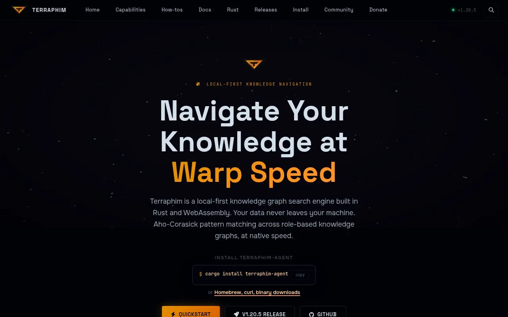
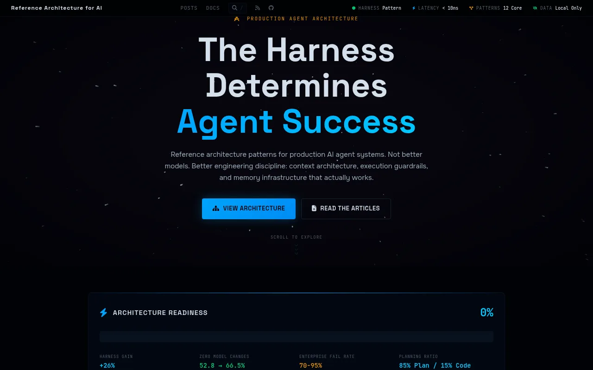
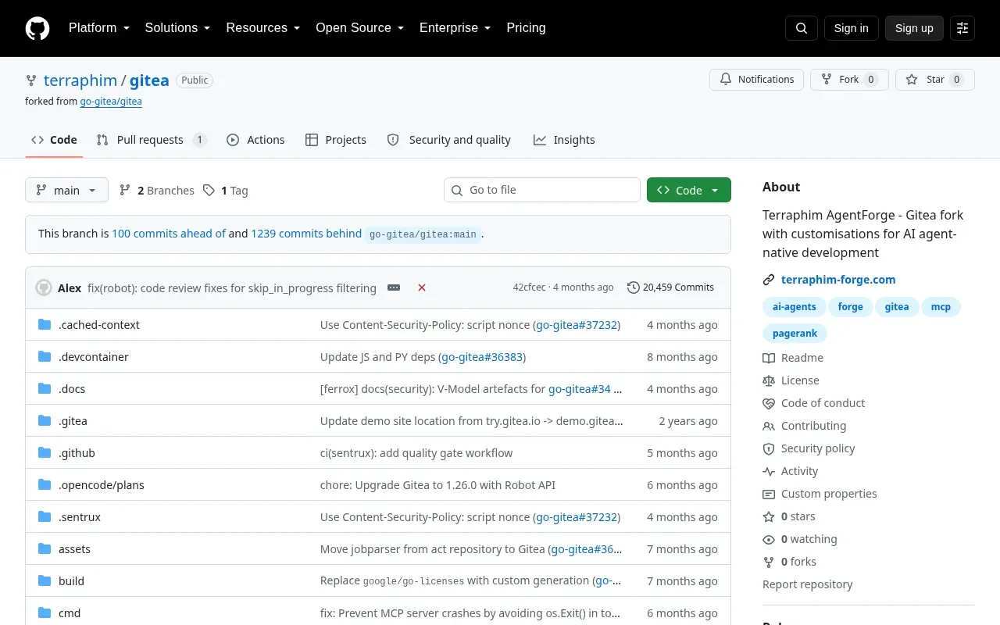
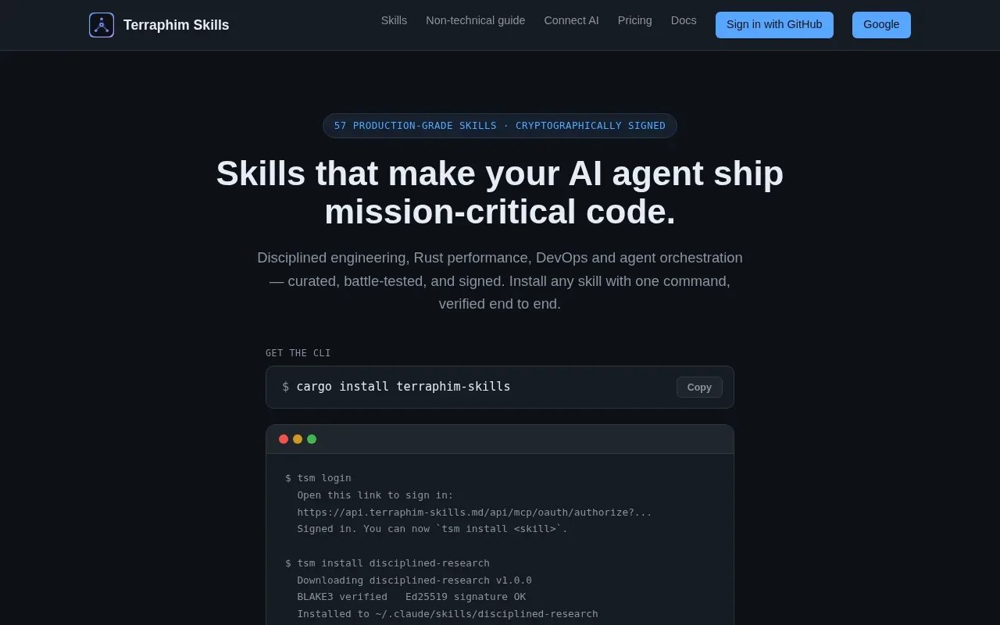
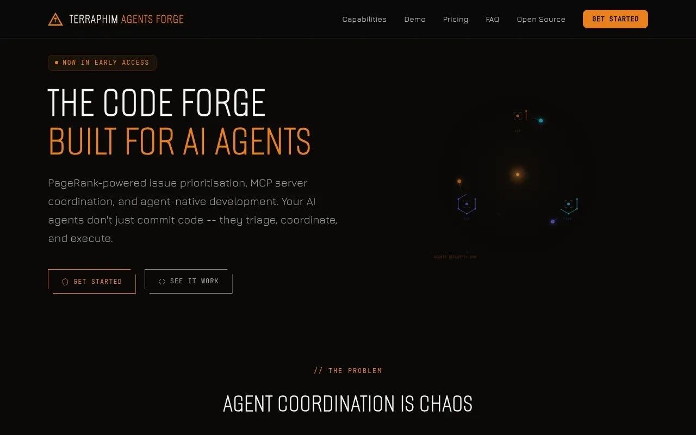
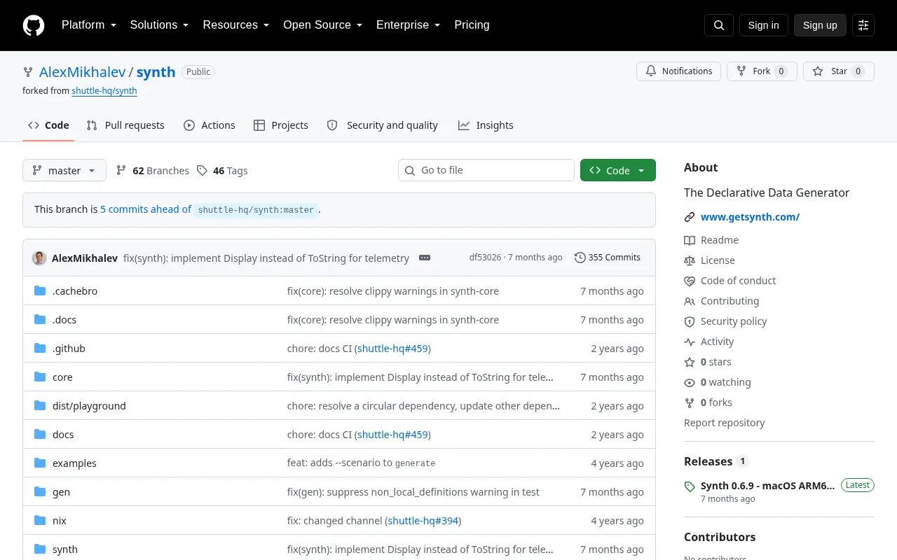

# Dr Alexander Mikhalev

**United Kingdom** · Systems thinker · Founder of [Terraphim](https://github.com/terraphim) & Applied Knowledge Systems

*Building privacy-preserving AI that works for the user — and the agent tooling that ships it.*

`Local-First AI` · `Knowledge Graphs` · `Agentic Engineering` · `Digital Twins` · `Systems Engineering` · `Rust`

<a href="#terraphim">Terraphim</a> · <a href="#open-source-highlights">Open Source</a> · <a href="#writing">Writing</a> · <a href="#recognition">Recognition</a> · <a href="#connect">Connect</a> · <a href="#background">Background</a>

  
  

---

## Terraphim

[**Terraphim**](https://github.com/terraphim) is a privacy-preserving AI assistant: a local-first knowledge graph search engine built in Rust and WebAssembly. Sub-millisecond Aho-Corasick pattern matching over role-based knowledge graphs — on your hardware, with zero telemetry, no account, and no cloud dependency. Ships as CLI, desktop app, HTTP server, MCP server, and browser extension, with native hooks for AI coding assistants.

  
  

  <a href="https://terraphim.ai"><strong>Website</strong></a> ·
  <a href="https://docs.terraphim.ai"><strong>Docs</strong></a> ·
  <a href="https://terraphim.ai/capabilities/origin-story/"><strong>Origin Story</strong></a> ·
  <a href="https://terraphim.discourse.group"><strong>Forum</strong></a>

---

## Open Source Highlights

### [**Terraphim AI**](https://github.com/terraphim/terraphim-ai) — the privacy-preserving AI assistant

Local-first knowledge graph search engine in Rust and WebAssembly: sub-millisecond Aho-Corasick matching over role-based knowledge graphs, zero telemetry, no account. Ships as CLI, Tauri desktop app, HTTP server, MCP server, and WASM browser extension — 52+ workspace crates.

  

### [**Reference Architecture for AI**](https://reference-architecture.ai/) — patterns for production agent systems

The harness, not the model, determines agent success — +26% benchmark gain (52.8 → 66.5% on Terminal Bench 2.0) with zero model changes. Context architecture, execution guardrails, and memory infrastructure that actually works. Organisation: [reference-architecture-ai](https://github.com/reference-architecture-ai) ([site source](https://github.com/reference-architecture-ai/reference-architecture.ai)) · [Medium publication](https://medium.com/reference-architecture-for-ai).

  

### [**Terraphim Agents Forge**](https://github.com/terraphim/gitea) — Gitea fork for AI agent-native development

Gitea fork extended for the agent economy: PageRank-powered issue triage, dependency graphs, native MCP server, and scoped robot accounts with full audit trails. Upstream-compatible — runs our fleet at [git.terraphim.cloud](https://git.terraphim.cloud).

  

### [**terraphim-skills.md**](https://terraphim-skills.md/) — production-grade skills for AI agents

57 curated, battle-tested, cryptographically signed skills for Claude Code, Codex, and other agent CLIs — disciplined engineering, Rust performance, DevOps, orchestration. One-command verified install: `cargo install terraphim-skills` → `tsm install <skill>`.

  

### [**Terraphim Forge**](https://terraphim-forge.com/) — the code forge built for AI agents

Pay-first SaaS that hands each customer their own Gitea-on-Firecracker microVM within ~30 seconds of checkout — container, npm, and Cargo registries included. Public demo (resets daily): [demo.terraphim-forge.com](https://demo.terraphim-forge.com).

  

### [**Synth**](https://github.com/AlexMikhalev/synth) — declarative synthetic data generation

The Declarative Data Generator: realistic, constraint-based synthetic data from schema-as-code — database agnostic, scales to millions of rows, version-controlled and peer-reviewable like any other code. Fork carrying the [getsynth/synth](https://github.com/getsynth/synth) lineage (★1.4k upstream) forward. Companion content: [synth-data-engineering](https://github.com/AlexMikhalev/synth-data-engineering).

  

Plus the entire **[Terraphim organisation](https://github.com/terraphim)** — 66 public repositories, **[52+ Rust workspace crates](https://terraphim.rs)**.

---

## Writing

- **[metacortex.engineer](https://metacortex.engineer)** — long-form engineering notes
- **[Terraphim origin story](https://terraphim.ai/capabilities/origin-story/)** — from The Pattern (Redis Hackathon Platinum winner) through Kaggle and Oxford to Terraphim AI
- **[INCOSE EMEA webinar](https://github.com/terraphim/INCOSE-Systems-Engineering-Handbook)** — semantic search over the systems engineering body of knowledge

---

## Recognition

- **Platinum winner, Redis "Build on Redis" Hackathon 2021** — real-time NLP for medical literature (The Pattern)
- **Innovate UK funded** — talent digital shadow, project "ATOMIC" (TSB Project No: 600594)
- Digital twin programmes for **Boeing** and **Rolls-Royce** aircraft networks
- Speaker, **INCOSE EMEA** — semantic search and systems engineering

---

## Connect

---

## Background

- Founder, **Applied Knowledge Systems Ltd** — applied AI, digital twins, sensor fusion
- **AI lead architect at Nationwide**; **CTO & Head of AI at Zestic AI** — taking innovation from idea to production ([metacortex.engineer](https://metacortex.engineer))
- **The Pattern** — Redis Hackathon **Platinum Winner**: outperformed Nvidia's ML pipeline for BERT QA inference on CPU; results presented at a public lecture at **Oxford University, Green Templeton College** ([origin story](https://terraphim.ai/capabilities/origin-story/))
- Methodology validated in the **INCOSE** community for the Systems Engineering Handbook v.4 — a recognised low-effort substitution for formal model-based systems engineering
- Systems engineering: operational digital twins of aircraft networks for **Boeing** and **Rolls-Royce**
- IoT sensor fusion: LiDAR and acoustic-based water-flow monitoring
- Building with knowledge graphs since the CORD-19 era; local-first AI full-time since 2022
- The name *Terraphim* comes from the [*Relict* series](https://www.goodreads.com/en/book/show/196710046) of science fiction novels by [Vasiliy Golovachev](https://en.wikipedia.org/wiki/Vasili_Golovachov) — an artificial intelligence living inside a spacesuit (part of an exocortex), designed to help you with your tasks
